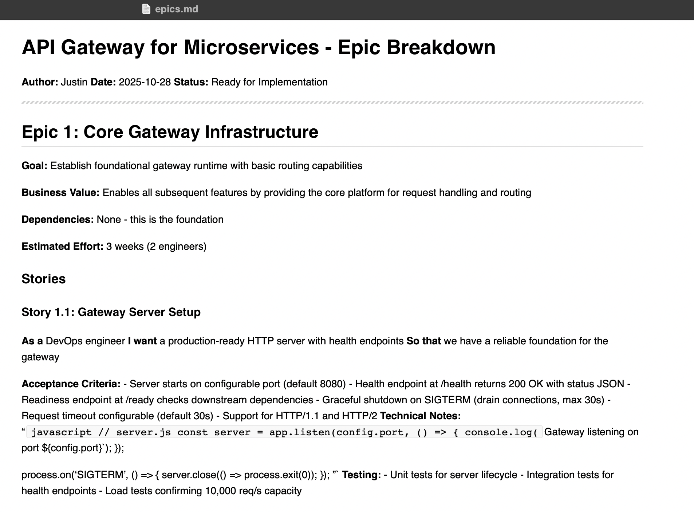

# Visual Comparison Guide

**How to See the Markdown Formatting Fix in Action**

This guide shows you exactly where to look to see the markdown formatting differences.

**IMPORTANT:** GitHub's markdown renderer is **lenient** and handles both versions reasonably well. To see the real difference, you need to view the files in **Mac Markdown.app** or other strict CommonMark parsers.

---

## 🎯 The Key Issue: Missing Blank Lines After Bold Headers

The most common problem in BMAD-generated markdown is **bold headers immediately followed by bullet lists with no blank line between them**.

**This violates the CommonMark specification** and causes rendering issues in strict markdown parsers like Mac Markdown.app, even though GitHub handles it gracefully.

---

## 📍 Example Location: Product Brief - Problem Statement

### Step 1: View the BEFORE version

**URL:** https://github.com/jheyworth/bmad-markdown-formatting-test/blob/dcf405f/docs/product-brief.md

**Scroll to:** "Problem Statement" section (around line 14)

**What you'll see in the source:**

```markdown
## Problem Statement
Our organization's transition to microservices has created several critical operational challenges:
**Security Vulnerabilities:**
- Each service implements its own authentication logic
- No centralized authorization enforcement
```

**Key observation:** There is NO blank line between line 16 (`**Security Vulnerabilities:**`) and line 17 (the first bullet)

**GitHub renders this as:** Actually renders reasonably well (GitHub is lenient)

**Mac Markdown.app renders this as:** Plain paragraph text - bullets don't format!

**CommonMark compliance:** ❌ Violates specification

### Step 2: View the AFTER version

**URL:** https://github.com/jheyworth/bmad-markdown-formatting-test/blob/0b30d47/docs/product-brief.md

**Scroll to:** "Problem Statement" section (around line 15)

**What you'll see in the source:**

```markdown
## Problem Statement

Our organization's transition to microservices has created several critical operational challenges:

**Security Vulnerabilities:**

- Each service implements its own authentication logic
- No centralized authorization enforcement
```

**Key observation:** There IS a blank line (line 20) between `**Security Vulnerabilities:**` (line 19) and the first bullet (line 21)

**GitHub renders this as:** Renders well (similar to before - GitHub was lenient)

**Mac Markdown.app renders this as:** Proper bullet list with visual formatting!

**CommonMark compliance:** ✅ Follows specification

---

## 🔍 How to Compare Side-by-Side

### Method 1: Two Browser Tabs

1. Open BEFORE in one tab: https://github.com/jheyworth/bmad-markdown-formatting-test/blob/dcf405f/docs/product-brief.md#problem-statement
2. Open AFTER in another tab: https://github.com/jheyworth/bmad-markdown-formatting-test/blob/0b30d47/docs/product-brief.md#problem-statement
3. Switch between tabs to see the difference

### Method 2: GitHub's Built-in Comparison

**URL:** https://github.com/jheyworth/bmad-markdown-formatting-test/compare/dcf405f...0b30d47

1. Click on "Files changed" tab
2. Find `docs/product-brief.md`
3. Look at the diff around line 16-21

**What the diff shows:**

```diff
 ## Problem Statement
+
 Our organization's transition to microservices has created several critical operational challenges:
+
 **Security Vulnerabilities:**
+
 - Each service implements its own authentication logic
```

Every `+` is a blank line being added by the fix!

---

## 📊 More Examples to Check

### Example 2: Acceptance Criteria in PRD

**Before:** https://github.com/jheyworth/bmad-markdown-formatting-test/blob/dcf405f/docs/PRD.md#functional-requirements

Look at FR001 "Acceptance Criteria:" (around line 44) - bullets flow together as text

**After:** https://github.com/jheyworth/bmad-markdown-formatting-test/blob/0b30d47/docs/PRD.md#functional-requirements

Same section - bullets now render as a proper list!

### Example 3: User Success Metrics Tables

**Before:** https://github.com/jheyworth/bmad-markdown-formatting-test/blob/dcf405f/docs/product-brief.md#user-success-metrics

Tables at lines 99-103 don't have blank lines before them

**After:** https://github.com/jheyworth/bmad-markdown-formatting-test/blob/0b30d47/docs/product-brief.md#user-success-metrics

Same tables now have blank lines and render perfectly!

### Example 4: Code Blocks in Epics

**Before:** https://github.com/jheyworth/bmad-markdown-formatting-test/blob/dcf405f/docs/epics.md#story-11-gateway-server-setup

Code blocks lack proper spacing

**After:** https://github.com/jheyworth/bmad-markdown-formatting-test/blob/0b30d47/docs/epics.md#story-11-gateway-server-setup

Code blocks have blank lines before/after with proper syntax highlighting

---

## 🎨 What Proper vs Broken Rendering Looks Like

### In GitHub (Both Look Similar)

GitHub's lenient parser handles both versions acceptably:

**Before Fix (no blank lines):** Lists render reasonably well
**After Fix (with blank lines):** Lists render well

**You won't see dramatic differences in GitHub!**

### In Mac Markdown.app (Clear Difference)

**Broken Rendering (Before Fix):**

When you open the before-fix file in Mac Markdown.app, you'll see:

```
Security Vulnerabilities: - Each service implements its own authentication logic - No centralized
authorization enforcement - Inconsistent security policies across services - Difficult to audit
access patterns Performance and Reliability Issues: - No protection against traffic spikes...
```

**Everything flows together as one paragraph!**

**Visual Proof - Actual Screenshot:**



This screenshot shows the real rendering in Mac Markdown.app where:
- Lists render as plain text instead of bullets
- Code blocks render as inline text
- Everything flows together as paragraphs
- Structure and formatting are completely lost

**Proper Rendering (After Fix):**

When you open the after-fix file in Mac Markdown.app, you'll see:

**Security Vulnerabilities:**

- Each service implements its own authentication logic
- No centralized authorization enforcement
- Inconsistent security policies across services
- Difficult to audit access patterns

**Performance and Reliability Issues:**

- No protection against traffic spikes
- Services can be overwhelmed by requests

**Beautiful, scannable, professional formatting!**

### The Takeaway

- GitHub hides the problem with lenient parsing
- Mac Markdown.app (and other strict parsers) expose it
- The fix ensures compatibility with ALL tools, not just GitHub

---

## 💡 The "Aha!" Moment

The fix is simple but makes a massive difference:

**ONE BLANK LINE** transforms unreadable plain text into properly formatted, professional documentation.

**Before:**
```markdown
**Header:**
- Bullet
```
↓ Renders as: "Header: - Bullet"

**After:**
```markdown
**Header:**

- Bullet
```
↓ Renders as:
> **Header:**
> - Bullet

---

## 🔢 By the Numbers

Across the 3 test documents:

- **99 bullet lists** - all fixed
- **36 numbered lists** - all fixed
- **11 tables** - all fixed
- **12+ code blocks** - all fixed
- **1112 lines changed** - all formatting, no content changes
- **0 issues remaining** ✅

---

## ✅ Quick Checklist for Reviewers

When reviewing the PR for BMAD-METHOD, check these specific examples:

- [ ] View product-brief.md before/after at "Problem Statement"
- [ ] View PRD.md before/after at "Functional Requirements"
- [ ] View epics.md before/after at any story's "Acceptance Criteria"
- [ ] Open GitHub comparison: dcf405f...0b30d47
- [ ] Observe the `+` additions are all blank lines
- [ ] Confirm no content was changed, only formatting

---

**Bottom Line:** This fix makes BMAD-generated documentation **CommonMark compliant** and ensures it renders properly in ALL markdown parsers, not just GitHub's lenient renderer!

---

_Updated: 2025-10-28_
_Test Repository: https://github.com/jheyworth/bmad-markdown-formatting-test_
